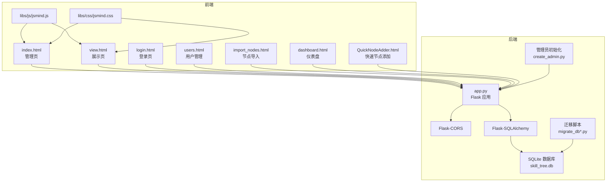
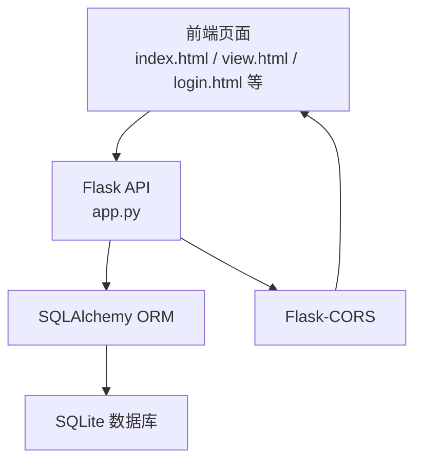
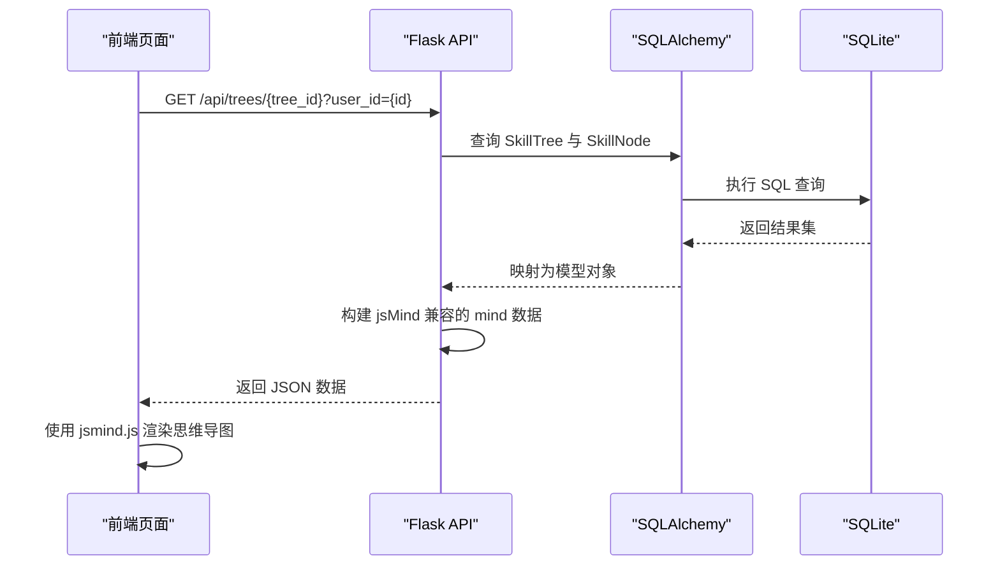
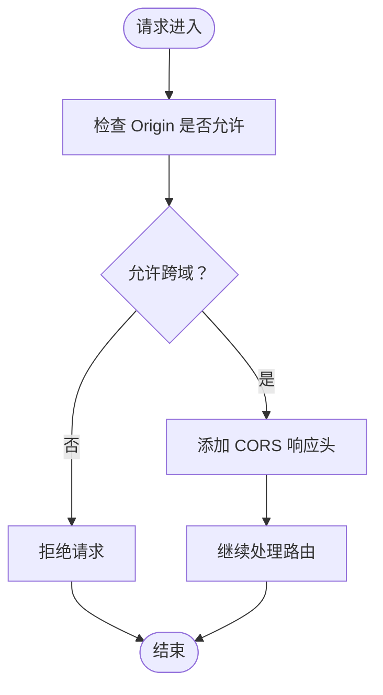
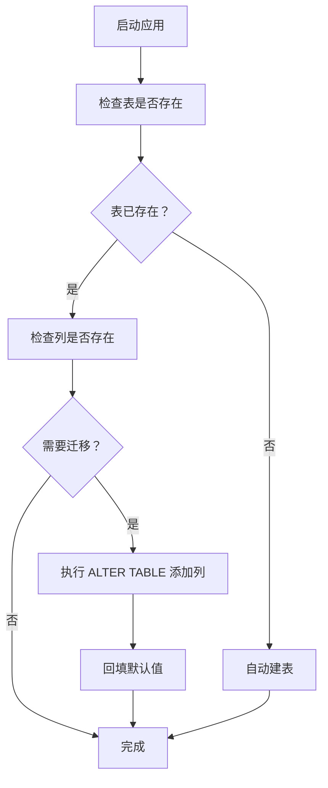
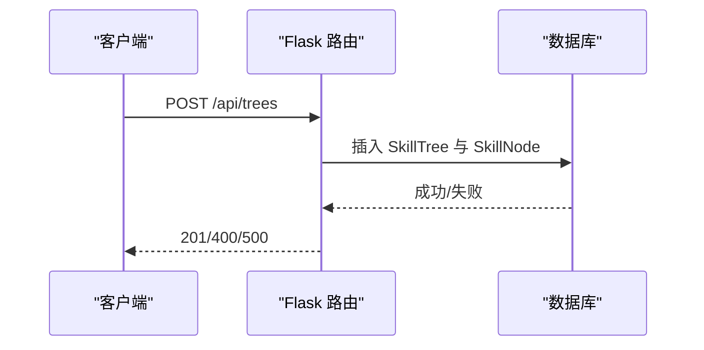
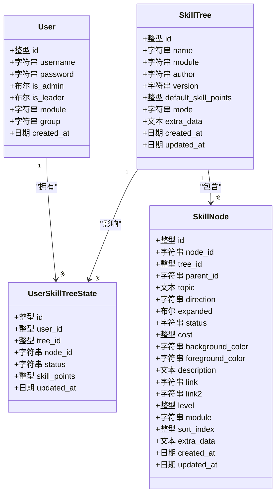
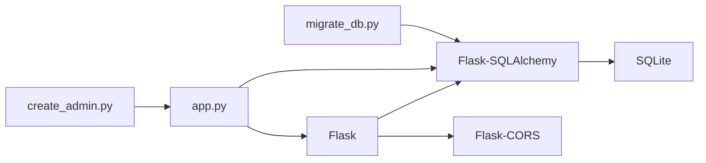

# 集成模式

<cite>
**本文引用的文件**
- [app.py](file://app.py)
- [requirements.txt](file://requirements.txt)
- [README.md](file://README.md)
- [index.html](file://index.html)
- [view.html](file://view.html)
- [create_admin.py](file://create_admin.py)
- [migrate_db.py](file://migrate_db.py)
- [migrate_db_v2.py](file://migrate_db_v2.py)
- [migrate_db_v3.py](file://migrate_db_v3.py)
- [_fix_mode.py](file://_fix_mode.py)
- [_fix_mode2.js](file://_fix_mode2.js)
- [_fix_mode3.js](file://_fix_mode3.js)
- [_fix_mode4.js](file://_fix_mode4.js)
- [_patch_mode.py](file://_patch_mode.py)
- [QuickNodeAdder.html](file://QuickNodeAdder.html)
- [dashboard.html](file://dashboard.html)
- [import_nodes.html](file://import_nodes.html)
- [login.html](file://login.html)
- [users.html](file://users.html)
</cite>

## 目录
1. [简介](#简介)
2. [项目结构](#项目结构)
3. [核心组件](#核心组件)
4. [架构总览](#架构总览)
5. [详细组件分析](#详细组件分析)
6. [依赖关系分析](#依赖关系分析)
7. [性能考量](#性能考量)
8. [故障排除指南](#故障排除指南)
9. [结论](#结论)
10. [附录](#附录)

## 简介
本技术文档聚焦“技能树管理系统”的集成模式，系统以 Flask 为核心后端，采用 SQLite 作为持久化存储，前端通过 jsMind 思维导图库进行可视化编辑与展示，并借助 Flask-CORS 实现跨域资源共享。文档将深入解析以下集成要点：
- jsMind 思维导图库的集成实现与数据格式约定
- Flask-CORS 的跨域配置与前端访问策略
- SQLite 数据库连接管理与迁移机制
- 前后端通信协议（RESTful API 规范、JSON 数据格式、错误码标准）
- 组件协作模式（前端页面与后端 API 的交互、数据模型与视图层绑定、权限控制与业务逻辑分离）
- 扩展点设计（插件机制、自定义激活规则、第三方认证集成）
- 部署集成考虑（静态资源部署、数据库迁移自动化、环境配置标准化）
- 集成测试策略（API 接口测试、前端组件测试、端到端集成测试）
- 最佳实践与故障排除指导

## 项目结构
项目采用“前后端同源/本地静态服务 + Flask 后端 API”的混合部署方式：
- 前端页面位于仓库根目录，包含管理页、展示页、登录页、用户管理页、节点导入页、仪表盘页等
- 第三方库（jsMind）位于 libs/js 与 libs/css
- 后端应用入口为 app.py，使用 Flask-SQLAlchemy 连接 SQLite
- 跨域由 Flask-CORS 提供支持
- 数据库迁移脚本与管理员初始化脚本辅助部署与运维

图表来源
- [app.py](file://app.py)
- [index.html](file://index.html)
- [view.html](file://view.html)
- [login.html](file://login.html)
- [users.html](file://users.html)
- [import_nodes.html](file://import_nodes.html)
- [dashboard.html](file://dashboard.html)
- [QuickNodeAdder.html](file://QuickNodeAdder.html)
- [libs/js/jsmind.js](file://libs/js/jsmind.js)
- [libs/css/jsmind.css](file://libs/css/jsmind.css)
- [migrate_db.py](file://migrate_db.py)
- [create_admin.py](file://create_admin.py)

章节来源
- [README.md](file://README.md)
- [requirements.txt](file://requirements.txt)

## 核心组件
- Flask 应用与路由：提供 RESTful API，覆盖用户、技能树、节点、状态、任务等资源的增删改查与业务操作
- 数据模型与 ORM：基于 SQLAlchemy 定义用户、技能树、节点、用户技能树状态、节点编辑历史、节点点击历史、学习任务等模型
- jsMind 集成：前端以 jsMind 渲染思维导图，后端提供 jsMind 兼容的数据结构
- 跨域支持：Flask-CORS 允许前端静态页面与后端 API 的跨域访问
- 数据库与迁移：SQLite + SQLAlchemy 自动建表；迁移脚本负责字段演进与数据修复
- 管理与运维：管理员初始化脚本、多版本迁移脚本、修复脚本与补丁脚本

章节来源
- [app.py](file://app.py)
- [requirements.txt](file://requirements.txt)
- [README.md](file://README.md)

## 架构总览
系统采用“静态前端 + 后端 API + SQLite”的轻量级架构。前端页面通过 AJAX 请求与后端交互，后端通过 SQLAlchemy 访问 SQLite 数据库。跨域通过 Flask-CORS 解决。

图表来源
- [app.py](file://app.py)
- [index.html](file://index.html)
- [view.html](file://view.html)
- [login.html](file://login.html)

## 详细组件分析

### 1) jsMind 思维导图库集成
- 前端渲染：管理页与展示页均引入 jsmind.css 与 jsmind.js，使用 jsMind 渲染思维导图
- 数据格式约定：后端在获取技能树时，将 SkillTree 与 SkillNode 结合，构建符合 jsMind 的 mind 数据结构，包含节点 id、topic、children、方向、展开状态、样式等字段
- 前端交互：管理页支持拖拽、编辑、保存；展示页支持只读展示与节点激活
- 扩展能力：支持额外样式与自定义数据（extra_data），便于后续扩展图标、链接等

图表来源
- [app.py](file://app.py)
- [index.html](file://index.html)
- [view.html](file://view.html)

章节来源
- [README.md](file://README.md)
- [app.py](file://app.py)
- [index.html](file://index.html)
- [view.html](file://view.html)

### 2) Flask-CORS 跨域资源共享配置
- 配置方式：在 Flask 应用初始化时启用 CORS，允许来自前端静态页面的跨域请求
- 影响范围：所有 API 路由均可被前端页面访问，无需额外手动设置响应头
- 部署建议：若前端与后端分离部署，需确保 CORS 配置满足目标域名与方法要求

图表来源
- [app.py](file://app.py)

章节来源
- [app.py](file://app.py)

### 3) SQLite 数据库连接管理与迁移
- 连接配置：使用 SQLAlchemy 的 SQLite URI 连接本地数据库文件
- 自动建表：首次运行时通过 SQLAlchemy 自动创建所需表
- 迁移策略：
  - 迁移脚本逐版本演进，新增字段（如 default_skill_points、module、mode）并回填默认值
  - 若迁移失败，提供删除数据库文件后重启自动重建的指引
  - 修复脚本与补丁脚本用于修复历史数据或模式问题

图表来源
- [migrate_db.py](file://migrate_db.py)
- [migrate_db_v2.py](file://migrate_db_v2.py)
- [migrate_db_v3.py](file://migrate_db_v3.py)
- [app.py](file://app.py)

章节来源
- [migrate_db.py](file://migrate_db.py)
- [migrate_db_v2.py](file://migrate_db_v2.py)
- [migrate_db_v3.py](file://migrate_db_v3.py)
- [app.py](file://app.py)

### 4) 前后端通信协议
- RESTful API 设计：遵循资源导向的 URL 与 HTTP 方法语义
- JSON 数据格式约定：
  - 请求体 Content-Type: application/json
  - 错误响应统一为 { "error": "..." } 或 { "message": "...", "..." }
- 错误码标准：
  - 400：参数错误/必填项缺失
  - 401：未授权/密码错误
  - 403：权限不足
  - 404：资源不存在
  - 500：服务器内部错误
  - 207：部分成功（批量导入场景）

图表来源
- [app.py](file://app.py)

章节来源
- [app.py](file://app.py)
- [README.md](file://README.md)

### 5) 组件协作模式
- 前后端交互模式：
  - 管理页：创建/更新/删除技能树，批量导入节点，设置激活规则模式
  - 展示页：选择用户与技能树，只读展示并支持节点激活
  - 登录页：用户凭据验证，返回用户角色与权限范围
- 数据模型与视图层绑定：
  - 后端模型（User/SkillTree/SkillNode/UserSkillTreeState）与前端 mind 数据结构相互映射
  - 用户技能树状态独立存储，保证多用户互不影响
- 权限控制与业务逻辑分离：
  - 权限校验集中在后端路由中，非管理员仅能操作所属模块的技能树
  - 激活规则（树形自下而上或线性路径）由技能树的 mode 字段决定，业务逻辑与视图解耦

图表来源
- [app.py](file://app.py)

章节来源
- [app.py](file://app.py)

### 6) 扩展点设计
- 插件机制：可在前端引入额外 jsMind 插件（如 draggable-node），并在管理页启用拖拽节点功能
- 自定义激活规则：通过技能树的 mode 字段支持 tree（树形）与 path（线性）两种模式，兼容前端传入的 linear 关键字
- 第三方认证集成：当前登录流程为简单明文校验，建议在生产环境替换为安全的认证方案（如 JWT、OAuth2），并在后端增加中间件拦截与权限判定

章节来源
- [app.py](file://app.py)
- [index.html](file://index.html)
- [view.html](file://view.html)

### 7) 部署集成考虑
- 静态资源部署：前端页面与 jsMind 资源可直接部署到任意静态服务器，确保路径与 libs/js、libs/css 一致
- 数据库迁移自动化：通过迁移脚本在启动时或运维阶段执行，确保数据库结构与代码一致
- 环境配置标准化：使用 requirements.txt 固定依赖版本，确保开发与生产环境一致性

章节来源
- [README.md](file://README.md)
- [requirements.txt](file://requirements.txt)
- [migrate_db.py](file://migrate_db.py)

### 8) 集成测试策略
- API 接口测试：
  - 使用 HTTP 客户端（如 curl 或 Postman）对 /api/* 路由进行 GET/POST/PUT/DELETE 测试
  - 验证错误码与错误消息格式一致性
- 前端组件测试：
  - 在浏览器中打开 index.html 与 view.html，验证 jsMind 渲染、节点激活、权限控制等功能
- 端到端集成测试：
  - 启动后端服务，使用前端页面完成“创建用户 → 创建技能树 → 导入节点 → 激活节点 → 查看状态”的完整流程

章节来源
- [app.py](file://app.py)
- [index.html](file://index.html)
- [view.html](file://view.html)

## 依赖关系分析
- 外部依赖：Flask、Flask-SQLAlchemy、Flask-CORS
- 内部依赖：app.py 中的模型定义与路由实现，迁移脚本与管理员初始化脚本

图表来源
- [requirements.txt](file://requirements.txt)
- [app.py](file://app.py)
- [migrate_db.py](file://migrate_db.py)
- [create_admin.py](file://create_admin.py)

章节来源
- [requirements.txt](file://requirements.txt)
- [app.py](file://app.py)

## 性能考量
- 数据库性能：
  - 为节点表建立复合索引以提升查询效率
  - 批量导入使用 flush/commit 控制事务边界，避免一次性提交造成内存压力
- 前端性能：
  - jsMind 渲染大量节点时建议分页或延迟加载
  - 避免频繁触发全量刷新，优先局部更新 mind 数据
- API 性能：
  - 对于大技能树，后端可考虑分页返回节点或提供增量更新接口

## 故障排除指南
- 跨域问题：
  - 确认 Flask-CORS 已正确安装与启用
  - 若跨域仍失败，检查前端请求的 Origin 是否在允许范围内
- 数据库迁移失败：
  - 按提示删除数据库文件后重启，系统将自动重建
  - 检查迁移脚本输出，确认字段添加与默认值回填是否成功
- 登录失败：
  - 当前登录为简单明文校验，确认用户名与密码匹配
  - 生产环境请替换为安全认证方案
- 节点激活异常：
  - 检查父节点是否已激活、技能点是否充足
  - 确认用户模块与技能树模块存在交集

章节来源
- [README.md](file://README.md)
- [app.py](file://app.py)
- [migrate_db.py](file://migrate_db.py)

## 结论
本系统通过 Flask + SQLAlchemy + SQLite + jsMind 的组合，实现了轻量高效的技能树管理与展示能力。jsMind 的无缝集成、Flask-CORS 的跨域支持以及完善的数据库迁移机制，共同构成了可维护、可扩展的集成模式。建议在生产环境中进一步强化认证与授权、优化大数据量下的渲染与查询性能，并完善自动化测试与监控体系。

## 附录
- 管理员初始化：运行 create_admin.py 快速创建默认管理员账户
- 运维脚本：使用 migrate_db.py、migrate_db_v2.py、migrate_db_v3.py 逐步演进数据库结构
- 修复与补丁：_fix_mode.py、_fix_mode2.js、_fix_mode3.js、_fix_mode4.js、_patch_mode.py 用于修复历史数据或模式问题

章节来源
- [create_admin.py](file://create_admin.py)
- [migrate_db.py](file://migrate_db.py)
- [migrate_db_v2.py](file://migrate_db_v2.py)
- [migrate_db_v3.py](file://migrate_db_v3.py)
- [_fix_mode.py](file://_fix_mode.py)
- [_fix_mode2.js](file://_fix_mode2.js)
- [_fix_mode3.js](file://_fix_mode3.js)
- [_fix_mode4.js](file://_fix_mode4.js)
- [_patch_mode.py](file://_patch_mode.py)