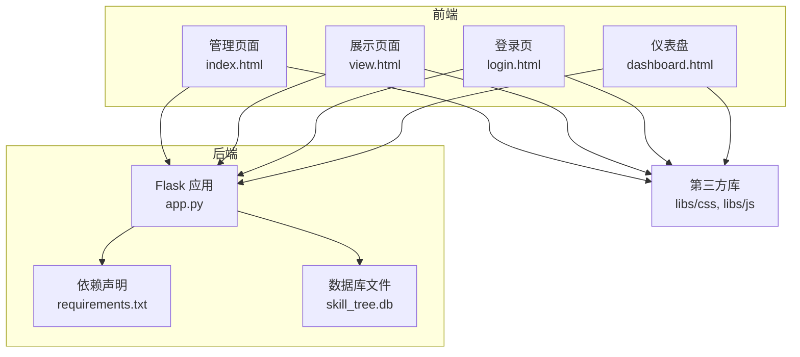
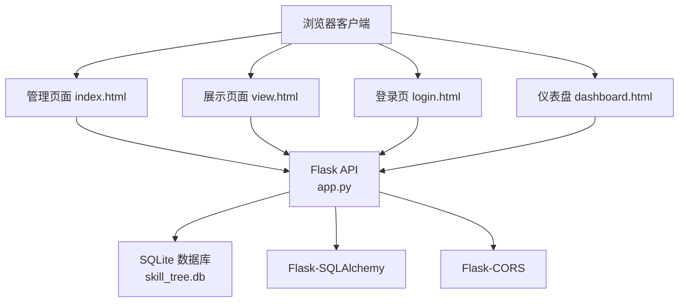
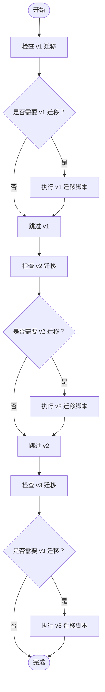
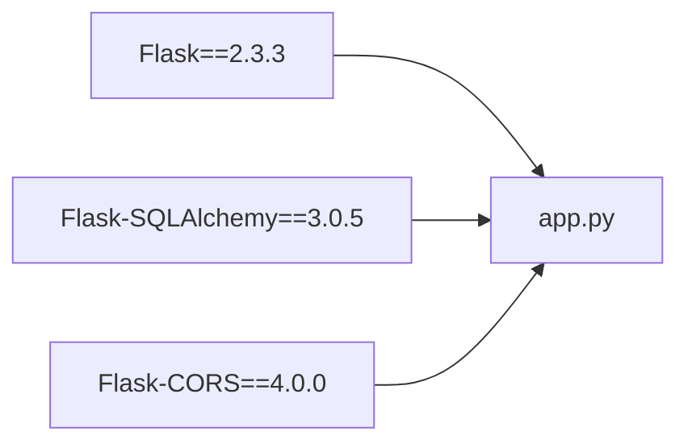

# 部署与运维

<cite>
**本文引用的文件**
- [app.py](file://app.py)
- [requirements.txt](file://requirements.txt)
- [run.bat](file://run.bat)
- [README.md](file://README.md)
- [migrate_db.py](file://migrate_db.py)
- [migrate_db_v2.py](file://migrate_db_v2.py)
- [migrate_db_v3.py](file://migrate_db_v3.py)
- [create_admin.py](file://create_admin.py)
- [index.html](file://index.html)
- [view.html](file://view.html)
- [login.html](file://login.html)
- [dashboard.html](file://dashboard.html)
</cite>

## 目录
1. [简介](#简介)
2. [项目结构](#项目结构)
3. [核心组件](#核心组件)
4. [架构总览](#架构总览)
5. [详细组件分析](#详细组件分析)
6. [依赖分析](#依赖分析)
7. [性能考虑](#性能考虑)
8. [故障排除指南](#故障排除指南)
9. [结论](#结论)
10. [附录](#附录)

## 简介
本文件面向运维工程师与平台管理员，提供技能树管理系统的完整部署与运维手册。内容涵盖生产环境部署步骤、服务器配置、环境变量、依赖安装、数据库备份与恢复、日志与监控、性能优化、故障排查、升级与版本管理、安全加固与防火墙建议，以及自动化部署与CI/CD集成思路。

## 项目结构
系统由后端Flask服务与静态前端页面组成，数据库为SQLite文件，便于单机部署与迁移。

图表来源
- [app.py:17-22](file://app.py#L17-L22)
- [requirements.txt:1-5](file://requirements.txt#L1-L5)
- [index.html:1-200](file://index.html#L1-L200)
- [view.html:1-200](file://view.html#L1-200)
- [login.html:136-220](file://login.html#L136-L220)
- [dashboard.html:959-1047](file://dashboard.html#L959-L1047)

章节来源
- [README.md:61-78](file://README.md#L61-L78)
- [app.py:17-22](file://app.py#L17-L22)
- [requirements.txt:1-5](file://requirements.txt#L1-L5)

## 核心组件
- 后端服务
  - Flask应用，提供REST API与静态文件服务。
  - 使用Flask-CORS允许跨域访问。
  - 使用Flask-SQLAlchemy连接SQLite数据库。
- 数据模型
  - 用户、技能树、技能节点、用户技能树状态、节点编辑历史、节点点击历史、学习任务等。
- 前端页面
  - 管理页面：技能树编辑、节点增删改、导入导出、用户管理。
  - 展示页面：只读展示、节点激活、技能点统计。
  - 登录页：用户认证与会话存储。
  - 仪表盘：模块/小组/用户维度的进度统计。
- 运维脚本
  - 数据库迁移脚本：v1/v2/v3，用于向后兼容与结构演进。
  - 管理员创建脚本：快速初始化管理员账号。

章节来源
- [app.py:25-177](file://app.py#L25-L177)
- [README.md:305-333](file://README.md#L305-L333)
- [migrate_db.py:8-36](file://migrate_db.py#L8-L36)
- [migrate_db_v2.py:6-30](file://migrate_db_v2.py#L6-L30)
- [migrate_db_v3.py:8-31](file://migrate_db_v3.py#L8-L31)
- [create_admin.py:7-25](file://create_admin.py#L7-L25)

## 架构总览
后端通过Flask提供API，前端页面通过HTTP请求与后端交互；数据库为本地SQLite文件，首次运行自动生成。

图表来源
- [app.py:17-22](file://app.py#L17-L22)
- [index.html:1-200](file://index.html#L1-200)
- [view.html:1-200](file://view.html#L1-200)
- [login.html:136-220](file://login.html#L136-L220)
- [dashboard.html:959-1047](file://dashboard.html#L959-L1047)

## 详细组件分析

### 部署与环境准备
- 操作系统支持
  - Windows：使用批处理脚本启动。
  - Linux/macOS：使用Python直接运行。
- 依赖安装
  - 使用pip安装requirements.txt中声明的依赖。
- 启动方式
  - Windows：双击运行批处理脚本，或在命令行执行对应命令。
  - Linux/macOS：在终端执行Python启动命令。
- 服务监听
  - 默认监听地址与端口请参考后端启动输出或配置。

章节来源
- [README.md:80-111](file://README.md#L80-L111)
- [run.bat:1-10](file://run.bat#L1-L10)
- [requirements.txt:1-5](file://requirements.txt#L1-L5)

### 数据库与迁移
- 数据库类型与位置
  - SQLite文件位于项目根目录，首次运行自动生成。
- 迁移策略
  - 提供v1/v2/v3迁移脚本，按顺序执行以保证结构一致。
  - 迁移脚本会检查字段是否存在，避免重复迁移。
- 迁移执行顺序
  - 建议按顺序执行：v1 → v2 → v3。
- 回退与重建
  - 若迁移失败，可停止服务后删除数据库文件，重启后自动重建。

图表来源
- [migrate_db.py:8-36](file://migrate_db.py#L8-L36)
- [migrate_db_v2.py:6-30](file://migrate_db_v2.py#L6-L30)
- [migrate_db_v3.py:8-31](file://migrate_db_v3.py#L8-L31)

章节来源
- [migrate_db.py:8-36](file://migrate_db.py#L8-L36)
- [migrate_db_v2.py:6-30](file://migrate_db_v2.py#L6-L30)
- [migrate_db_v3.py:8-31](file://migrate_db_v3.py#L8-L31)

### 日志与监控
- 日志
  - 当前未内置日志框架，建议在生产环境启用日志记录，并将Flask的访问日志与错误日志输出到文件。
- 监控指标
  - 建议采集以下指标：请求量、响应时间、错误率、数据库连接数、CPU/内存占用。
  - 可结合系统自带监控工具或第三方APM进行采集。

章节来源
- [app.py:17-22](file://app.py#L17-L22)

### 安全加固与防火墙
- 跨域与CORS
  - 已启用CORS，生产环境建议限制允许的源与方法。
- 认证与授权
  - 登录页负责用户认证，前端将用户信息存储于本地存储；建议在生产环境增加HTTPS与更严格的会话管理。
- 防火墙
  - 仅开放必要端口（如HTTP/HTTPS），限制来源IP白名单。

章节来源
- [app.py:20](file://app.py#L20)
- [login.html:156-206](file://login.html#L156-L206)

### 性能优化与资源监控
- 数据库性能
  - SQLite适合小规模场景；若并发较高，建议评估迁移到更强大的数据库。
- 前端静态资源
  - 建议开启浏览器缓存与压缩，减少带宽与延迟。
- 服务器资源
  - 监控CPU/内存/磁盘IO，合理设置进程与线程数量。

章节来源
- [README.md:292-296](file://README.md#L292-L296)

### 故障排除指南
- 启动失败
  - 检查Python与pip环境，确认依赖安装成功。
  - 查看控制台输出与系统日志。
- 跨域错误
  - 确认CORS已启用且配置正确。
- 数据库异常
  - 执行迁移脚本修复结构；若仍失败，删除数据库文件后重启服务。
- 登录问题
  - 检查用户名与密码；确认管理员账户已创建。

章节来源
- [README.md:300-303](file://README.md#L300-L303)
- [create_admin.py:7-25](file://create_admin.py#L7-L25)

### 升级与版本管理
- 版本演进
  - 通过迁移脚本逐步升级数据库结构。
- 发布策略
  - 建议在维护窗口内停机发布，执行迁移后再启动服务。
- 回滚策略
  - 保留数据库快照，必要时回滚到上一个稳定版本。

章节来源
- [migrate_db.py:8-36](file://migrate_db.py#L8-L36)
- [migrate_db_v2.py:6-30](file://migrate_db_v2.py#L6-L30)
- [migrate_db_v3.py:8-31](file://migrate_db_v3.py#L8-L31)

### 自动化部署与CI/CD
- CI/CD建议
  - 代码变更触发构建与测试；通过容器镜像分发；使用编排工具进行滚动更新。
- 部署脚本
  - 可将依赖安装、迁移执行、服务重启封装为部署脚本，统一入口。

章节来源
- [requirements.txt:1-5](file://requirements.txt#L1-L5)
- [README.md:80-111](file://README.md#L80-L111)

## 依赖分析
后端依赖集中于requirements.txt，主要组件如下：

图表来源
- [requirements.txt:1-5](file://requirements.txt#L1-L5)
- [app.py:5-22](file://app.py#L5-L22)

章节来源
- [requirements.txt:1-5](file://requirements.txt#L1-L5)
- [app.py:5-22](file://app.py#L5-L22)

## 性能考虑
- 数据库
  - SQLite适合轻量场景；高并发建议迁移到PostgreSQL/MySQL。
- 缓存
  - 对热点查询结果进行缓存，降低数据库压力。
- 并发
  - 合理设置工作进程数，避免阻塞I/O导致的性能下降。
- 前端
  - 合理拆分与压缩静态资源，启用Gzip/HTTP/2。

章节来源
- [README.md:292-296](file://README.md#L292-L296)

## 故障排除指南
- 依赖缺失
  - 执行依赖安装命令，确保所有包安装成功。
- 数据库迁移失败
  - 按顺序执行迁移脚本；若仍失败，删除数据库文件后重启服务。
- 跨域问题
  - 确认CORS中间件已启用且配置正确。
- 登录失败
  - 检查用户名与密码；确认管理员账户已创建。

章节来源
- [README.md:300-303](file://README.md#L300-L303)
- [create_admin.py:7-25](file://create_admin.py#L7-L25)

## 结论
本运维手册提供了从部署到运维的全流程指导。建议在生产环境中启用HTTPS、严格CORS策略、完善的日志与监控体系，并制定标准化的升级与回滚流程，以保障系统的稳定性与安全性。

## 附录
- 快速检查清单
  - 环境变量与依赖安装完成
  - 数据库迁移脚本执行成功
  - 服务启动并可通过健康检查
  - 日志与监控已就绪
  - 安全策略已生效
  - 备份与恢复流程已演练