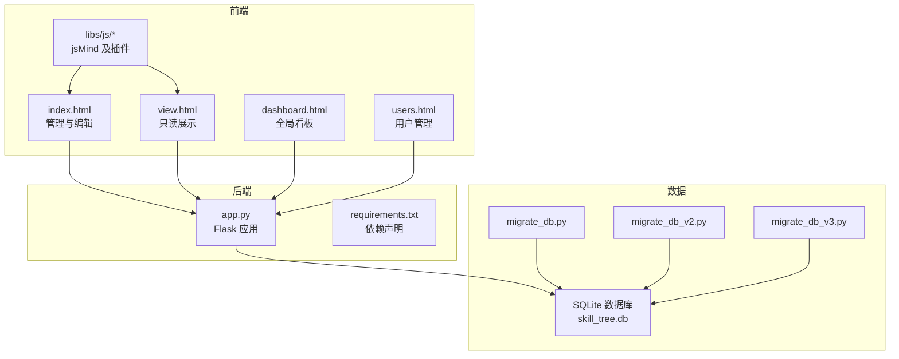
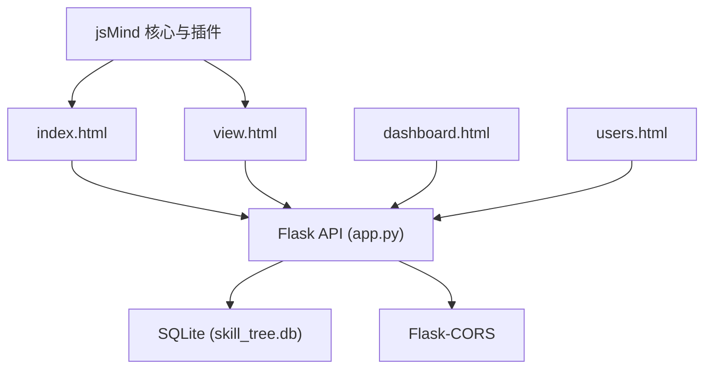
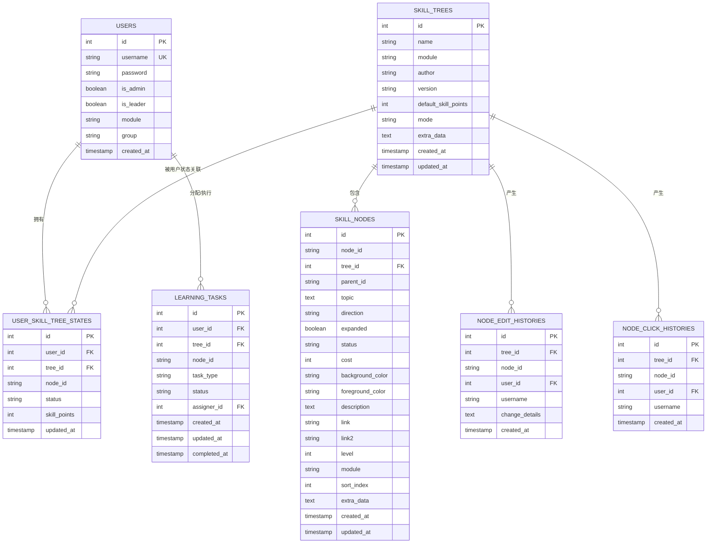
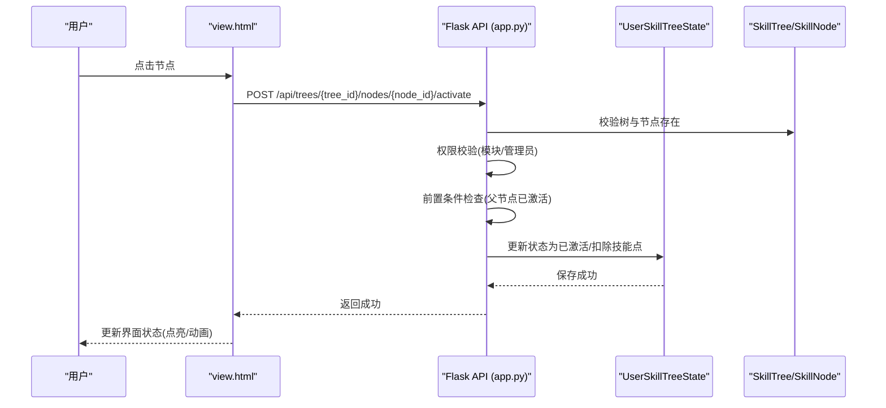
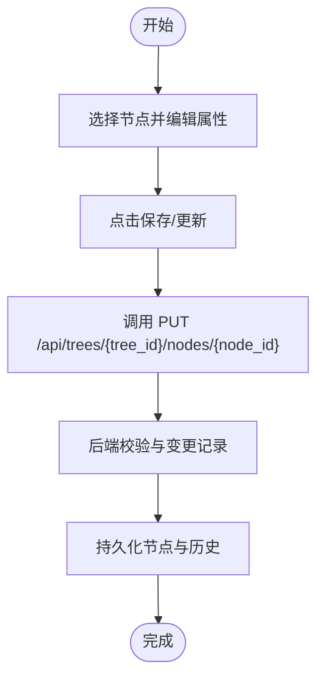
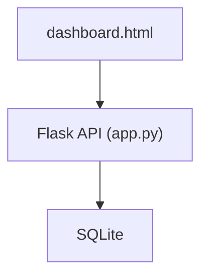
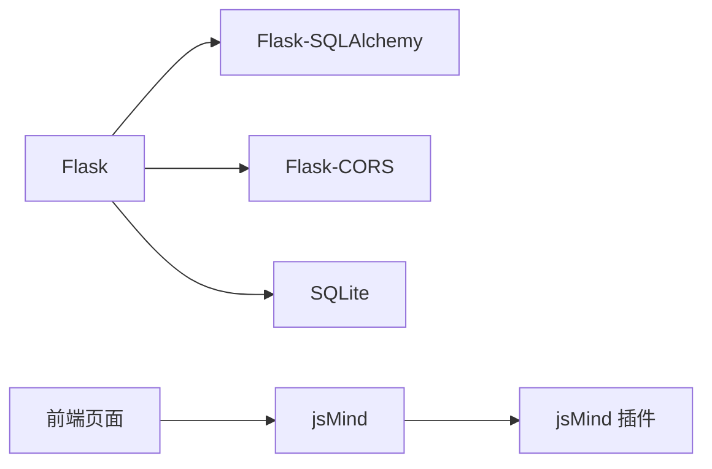

# 项目概述

<cite>
**本文引用的文件**
- [README.md](file://README.md)
- [app.py](file://app.py)
- [requirements.txt](file://requirements.txt)
- [index.html](file://index.html)
- [view.html](file://view.html)
- [dashboard.html](file://dashboard.html)
- [users.html](file://users.html)
- [libs/js/jsmind.js](file://libs/js/jsmind.js)
- [libs/js/jsmind.draggable-node.js](file://libs/js/jsmind.draggable-node.js)
- [create_admin.py](file://create_admin.py)
- [migrate_db.py](file://migrate_db.py)
- [migrate_db_v2.py](file://migrate_db_v2.py)
- [migrate_db_v3.py](file://migrate_db_v3.py)
</cite>

## 目录
1. [简介](#简介)
2. [项目结构](#项目结构)
3. [核心组件](#核心组件)
4. [架构总览](#架构总览)
5. [详细组件分析](#详细组件分析)
6. [依赖分析](#依赖分析)
7. [性能考虑](#性能考虑)
8. [故障排查指南](#故障排查指南)
9. [结论](#结论)
10. [附录](#附录)

## 简介
本项目是一个基于 jsMind 和 Flask 的技能树管理系统，面向团队/组织的“个人成长与能力发展”场景，提供多用户、权限控制、状态持久化与技能点系统，支持可视化编辑与只读展示。系统以“树状技能图谱”为核心载体，结合前端 jsMind 的思维导图渲染与交互能力，后端通过 Flask 提供 REST API，使用 SQLAlchemy 持久化到 SQLite 数据库。

- 业务价值
  - 多用户支持：每个用户拥有独立的技能树状态与技能点，互不影响。
  - 权限管理：管理员可重置所有用户技能树；普通用户仅能管理自身。
  - 状态持久化：节点激活状态与技能点随用户独立保存。
  - 技能点系统：为节点点亮设置门槛，形成“资源约束”的学习路径。
  - 可视化与交互：基于 jsMind 的拖拽、展开/折叠、颜色主题等，提升体验。
  - 展示与看板：提供只读展示页与全局看板，便于汇报与追踪。

- 目标用户
  - 教育/培训组织：教练、课程运营、学习管理者。
  - 企业内训：HR、部门负责人、学习与发展团队。
  - 个人成长：自我驱动的学习者，进行技能盘点与路径规划。

- 创新点与差异化
  - 将“树状前置条件”与“线性进阶模式”两种激活规则抽象为可配置模式，满足不同领域模型。
  - 引入“模块/组别/组长”等维度，实现更细粒度的权限与数据隔离。
  - 提供“CSV 导入”“节点编辑历史”“学习任务”等增强能力，贴近组织落地。

**章节来源**
- [README.md:1-358](file://README.md#L1-L358)

## 项目结构
项目采用前后端分离与静态页面为主的结构：前端页面通过本地文件或简单静态服务访问，后端 Flask 提供 API；数据库为 SQLite，位于实例目录中。

**图表来源**
- [index.html:1-800](file://index.html#L1-L800)
- [view.html:1-200](file://view.html#L1-L200)
- [dashboard.html:1-800](file://dashboard.html#L1-L800)
- [users.html:1-200](file://users.html#L1-L200)
- [libs/js/jsmind.js:1-200](file://libs/js/jsmind.js#L1-L200)
- [libs/js/jsmind.draggable-node.js:1-200](file://libs/js/jsmind.draggable-node.js#L1-L200)
- [app.py:1-800](file://app.py#L1-L800)
- [requirements.txt:1-5](file://requirements.txt#L1-L5)
- [migrate_db.py:1-41](file://migrate_db.py#L1-L41)
- [migrate_db_v2.py:1-34](file://migrate_db_v2.py#L1-L34)
- [migrate_db_v3.py:1-35](file://migrate_db_v3.py#L1-L35)

**章节来源**
- [README.md:61-78](file://README.md#L61-L78)
- [requirements.txt:1-5](file://requirements.txt#L1-L5)

## 核心组件
- 后端 Flask 应用
  - 提供技能树、节点、用户、权限、CSV 导入、学习任务等 API。
  - 使用 SQLAlchemy 定义模型与关系，支持多表关联与唯一约束。
  - 支持跨域访问，便于前后端分离部署。

- 前端页面
  - 管理页：可视化编辑、节点增删改、颜色主题、导入预览与提交。
  - 展示页：只读展示、节点激活、技能点显示、重置。
  - 看板页：全局指标、模块/组别进度、排行榜、任务分配与审核。
  - 用户管理页：用户增删改、角色与分组。

- jsMind 与插件
  - jsMind 负责思维导图渲染与交互。
  - jsMind.draggable-node 插件提供节点拖拽能力（需相应配置启用）。

- 数据库与迁移
  - SQLite 数据库存储用户、技能树、节点、状态、历史与任务。
  - 多版本迁移脚本逐步增加字段与表，保证演进兼容。

**章节来源**
- [app.py:25-122](file://app.py#L25-L122)
- [index.html:1-800](file://index.html#L1-L800)
- [view.html:1-200](file://view.html#L1-L200)
- [dashboard.html:1-800](file://dashboard.html#L1-L800)
- [users.html:1-200](file://users.html#L1-L200)
- [libs/js/jsmind.js:1-200](file://libs/js/jsmind.js#L1-L200)
- [libs/js/jsmind.draggable-node.js:1-200](file://libs/js/jsmind.draggable-node.js#L1-L200)
- [migrate_db.py:8-36](file://migrate_db.py#L8-L36)
- [migrate_db_v2.py:6-31](file://migrate_db_v2.py#L6-L31)
- [migrate_db_v3.py:8-31](file://migrate_db_v3.py#L8-L31)

## 架构总览
系统采用“静态前端 + Flask 后端 + SQLite 数据库”的轻量架构。前端页面通过 AJAX 调用后端 API，实现技能树的增删改查、节点激活、用户管理与看板统计。

**图表来源**
- [app.py:5-22](file://app.py#L5-L22)
- [index.html:1-800](file://index.html#L1-L800)
- [view.html:1-200](file://view.html#L1-L200)
- [dashboard.html:1-800](file://dashboard.html#L1-L800)
- [users.html:1-200](file://users.html#L1-L200)
- [libs/js/jsmind.js:1-200](file://libs/js/jsmind.js#L1-L200)
- [libs/js/jsmind.draggable-node.js:1-200](file://libs/js/jsmind.draggable-node.js#L1-L200)

## 详细组件分析

### 后端模型与数据流
- 用户(User)：用户名、密码、管理员/组长标志、模块/组别、创建时间。
- 技能树(SkillTree)：名称、作者、版本、默认技能点、激活模式(tree/path)、额外数据、模块等。
- 节点(SkillNode)：节点ID、父ID、主题、方向、展开状态、状态(锁定/解锁/激活)、成本、颜色、描述与链接、等级/模块/排序等。
- 用户技能树状态(UserSkillTreeState)：用户-技能树-节点的组合状态与可用技能点。
- 节点编辑历史(NodeEditHistory)、节点点击历史(NodeClickHistory)、学习任务(LearningTask)等扩展表。

**图表来源**
- [app.py:25-177](file://app.py#L25-L177)

**章节来源**
- [app.py:25-177](file://app.py#L25-L177)

### 前端交互流程（节点激活）
用户在展示页点击节点，前端调用后端 API，后端进行权限与前置条件校验，再更新用户技能树状态并持久化。

**图表来源**
- [view.html:1-200](file://view.html#L1-L200)
- [app.py:777-800](file://app.py#L777-L800)

**章节来源**
- [README.md:43-54](file://README.md#L43-L54)
- [app.py:777-800](file://app.py#L777-L800)

### 管理页编辑流程（新增/更新节点）
管理员在管理页编辑技能树，前端调用后端 API，后端保存节点并记录编辑历史。

**图表来源**
- [index.html:1-800](file://index.html#L1-L800)
- [app.py:712-774](file://app.py#L712-L774)

**章节来源**
- [README.md:21-26](file://README.md#L21-L26)
- [app.py:712-774](file://app.py#L712-L774)

### 看板与全局统计
看板页聚合用户、技能树、节点激活等数据，计算模块/组别进度与排行榜，并支持任务分配与审核。

**图表来源**
- [dashboard.html:1-800](file://dashboard.html#L1-L800)
- [app.py:385-413](file://app.py#L385-L413)

**章节来源**
- [dashboard.html:1-800](file://dashboard.html#L1-L800)
- [app.py:385-413](file://app.py#L385-L413)

## 依赖分析
- 后端依赖
  - Flask：Web 框架
  - Flask-SQLAlchemy：ORM
  - Flask-CORS：跨域支持

- 前端依赖
  - jsMind：思维导图渲染与交互
  - jsMind.draggable-node：节点拖拽插件（按需启用）

- 数据库
  - SQLite：轻量、无需额外服务端

**图表来源**
- [requirements.txt:1-5](file://requirements.txt#L1-L5)
- [libs/js/jsmind.js:1-200](file://libs/js/jsmind.js#L1-L200)
- [libs/js/jsmind.draggable-node.js:1-200](file://libs/js/jsmind.draggable-node.js#L1-L200)

**章节来源**
- [requirements.txt:1-5](file://requirements.txt#L1-L5)

## 性能考虑
- 前端
  - jsMind 渲染大量节点时建议分页/懒加载与限制缩放级别，避免 DOM 过载。
  - 使用 CSS 变量统一主题，减少重复样式计算。
- 后端
  - 查询路径：按用户-技能树-节点建立索引，避免全表扫描。
  - 批量导入：使用批量插入与事务，减少往返与锁竞争。
  - 跨域：生产环境建议明确允许源，避免通配导致性能与安全问题。
- 数据库
  - SQLite 适合中小规模数据；若并发高，可考虑迁移至 PostgreSQL/MySQL 并引入连接池。

[本节为通用指导，不直接分析具体文件]

## 故障排查指南
- 启动与访问
  - 后端：确保 Flask 服务在 5000 端口运行；前端通过本地静态服务器或直接打开 HTML。
  - 跨域：如遇跨域错误，确认已安装并启用 Flask-CORS。
- 数据库
  - 首次运行会自动生成数据库文件；如迁移失败，可按提示删除数据库文件后重启服务。
  - 使用迁移脚本逐步升级字段与表结构。
- 管理员账户
  - 使用脚本快速创建默认管理员账号，便于首次登录与初始化。
- 常见问题
  - 节点拖拽无效：确认已引入并启用 jsMind.draggable-node 插件。
  - 技能点不生效：检查用户状态表中技能点字段是否正确更新。

**章节来源**
- [README.md:80-112](file://README.md#L80-L112)
- [README.md:298-304](file://README.md#L298-L304)
- [create_admin.py:1-30](file://create_admin.py#L1-L30)
- [migrate_db.py:8-36](file://migrate_db.py#L8-L36)
- [migrate_db_v2.py:6-31](file://migrate_db_v2.py#L6-L31)
- [migrate_db_v3.py:8-31](file://migrate_db_v3.py#L8-L31)

## 结论
本项目以“树状技能图谱”为核心，结合 jsMind 的可视化能力与 Flask 的轻量后端，构建了具备多用户、权限、状态持久化与技能点系统的完整闭环。其模块化与可扩展的设计，使其既能满足个人成长场景，也能支撑组织级的学习与发展管理。通过看板与任务体系，进一步提升了过程可见性与结果导向。

[本节为总结性内容，不直接分析具体文件]

## 附录

### 技术栈概览
- 前端：HTML5、CSS3、JavaScript、jsMind、jsMind.draggable-node
- 后端：Python、Flask、Flask-CORS、Flask-SQLAlchemy
- 数据库：SQLite
- 运行：Windows 批处理脚本或 Python 直启

**章节来源**
- [README.md:292-297](file://README.md#L292-L297)
- [requirements.txt:1-5](file://requirements.txt#L1-L5)

### API 概览（节选）
- 技能树：GET/POST/PUT/DELETE /api/trees
- 节点：PUT /api/trees/{tree_id}/nodes/{node_id}
- 激活/取消：POST /api/trees/{tree_id}/nodes/{node_id}/activate
- 用户：POST/GET/PUT /api/users
- 看板：GET /api/skill-trees/list
- CSV 导入：POST /admin/skill/import-preview, POST /admin/skill/import-submit

**章节来源**
- [README.md:113-214](file://README.md#L113-L214)